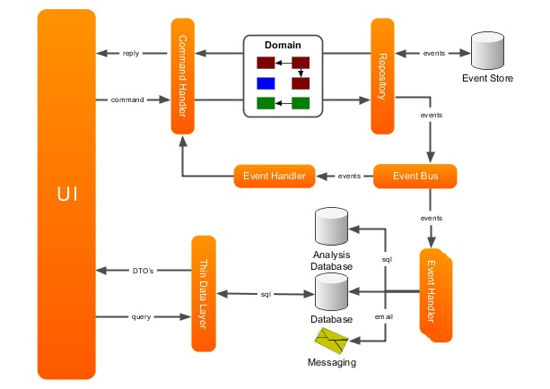

# Design

## Schéma


Source: https://domaindrivendesign.org/ddd-domain-driven-design/

## Exemple de structure de dossier

```
/App
  /ProjectName.Web.Public
  /ProjectName.Web.Admin
  /ProjectName.Web.SomeOtherStuff
/Domain
  /ProjectName.Domain.Core
  /ProjectName.Domain.BoundedContext1
  /ProjectName.Domain.BoundedContext1.Services
  /ProjectName.Domain.BoundedContext2
  /ProjectName.Domain.BoundedContext2.Command
  /ProjectName.Domain.BoundedContext2.Query
  /ProjectName.Domain.BoundedContext3
/Data
  /ProjectName.Data
/Libs
  /Problem1Resolver
  /Problem2Resolver

```

Les projets du dossier `Libs` sont indépendants du domaine. Ils ne résolvent que leur tâche locale, par exemple, la génération de rapports, l'analyse des csv, les mécanismes de mise en cache, etc. 

La structure de `Domain` correspond à celle de BoundedContext. Les projets du domaine sont indépendants de Data. 

`Data` contient DbContext, les migrations, les configurations liées à DAL. Data dépend des entités Domain pour construire les migrations. 

Les projets du dossier `App` utilisent un conteneur IOC pour l'injection de dépendances. 

Ainsi, il s'avère que l'on obtient une isolation maximale du code du domaine par rapport à l'infrastructure.

source: https://domaindrivendesign.org/project-structure/

## Comment modéliser un simple Agrégat ? 

Regrouper les entités et objets-valeur dans un agrégat est un des pattern les moins bien compris parmis la liste des tactiques DDD.
Quelques quesitons qui peuvent être utiles:

- Y a-t-il une limite pratique au nombre d'objets qui devraient être autorisés à résider dans le graphe d'objets ?
- Puisqu'une instance d'agrégat peut faire référence à d'autres instances d'agrégat, les associations peuvent-elles être parcourues en profondeur, en modifiant divers objets en cours de route ? 

Comme nous allons le voir, il est impératif d'éviter qu'un agrégat soit trop grand ou au contraire trop petit sans protection des véritables invariants.

### Règle : _Modéliser les véritables invariants du contexte borné_

Lorsque nous essayons de découvrir les agrégats dans un contexte borné, nous devons comprendre les vrais invariants du modèle. Ce n'est qu'avec cette connaissance que nous pouvons déterminer quels objets doivent être regroupés dans un agrégat donné.

Tout ce qui est à l'intérieur adhère à un ensemble spécifique de règles invariantes métier quelles que soient les opérations effectuées. La cohérence de tout ce qui se trouve en dehors de cette limite n'est pas pertinente pour l'agrégat. Ainsi, agrégat est synonyme de **frontière de cohérence transactionnelle**. 

Un agrégat correctement conçu est un agrégat qui peut être modifié de toutes les manières possibles par l'entreprise et dont les invariants sont totalement cohérents au sein d'une même transaction.

Et un contexte borné correctement conçu ne modifie qu'une seule instance d'agrégat par transaction dans toutes les circonstances.

Limiter la modification d'une instance d'agrégat par transaction peut sembler trop strict. Cependant, il s'agit d'une règle empirique qui devrait être l'objectif dans la plupart des cas. Cela répond à la raison même de l'utilisation des agrégats. 

### Règle: _Modéliser de petits agrégats_

Si nous devons concevoir de petits agrégats, que signifie "petit" ? L'extrême serait un agrégat avec seulement son identité unique globale et un attribut supplémentaire, ce qui n'est pas ce qui est recommandé. 
Il s'agit plutôt de limiter l'agrégat à l'entité racine et à un nombre minimal d'attributs et/ou de propriétés. Le minimum correct sont ceux nécessaires, et pas plus. Quels sont ceux nécessaires ? La réponse est simple : ceux qui doivent être cohérents avec les autres, même si les experts du domaine ne les spécifient pas en tant que règles. 

continuer ici avvec l'exemple de descr et name

Sinon problème de performance (voir exemple dans l'article ci-dessous). Si par ex dans un use case basique on load beaucoup trop d'entités que nécessaires, cela peut induire des probèmes de performance.

Source: https://www.dddcommunity.org/wp-content/uploads/files/pdf_articles/Vernon_2011_1.pdf
